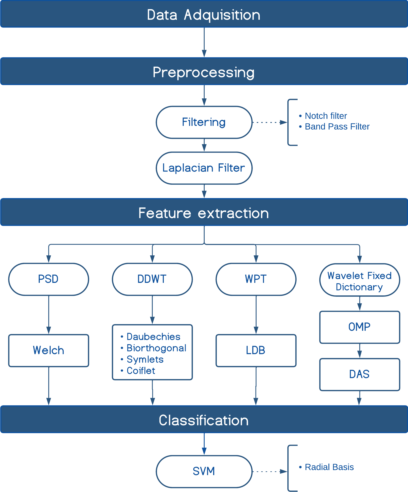

# Physiologically-Grounded-Sparse-Wavelet-Methods-for-Motor-Intention-EEG-Decoding

This repository contains the code associated with the article:

**Physiologically Grounded Sparse Features Enhance Motor Intention Classification for Rehabilitation Brain–Computer Interfaces**

This work proposes a feature extraction framework based on sparse wavelet representations with discriminative atom selection (DAS-OMP), evaluated against Wavelet Packet with Loccal Discriminant Basis, Dyadic Wavelet and Power Spectral Density baselines. The framework is motivated by the neurophysiology of transient β-burst activity and targets improved motor
intention decoding under realistic clinical constraints.

## Dataset: https://zenodo.org/records/17980608
---

## Motivation

Electroencephalography (EEG)-based Brain–Computer Interfaces (BCIs) for motor rehabilitation face severe practical constraints, including:

- a limited number of EEG channels (5 channels),
- few calibration trials,
- high inter-subject variability,
- and the transient nature of motor-related neural activity.

Traditional spectral approaches (e.g., PSD) rely on stationarity assumptions and tend to obscure short-lived motor-related events. While wavelet-based methods introduce time–frequency localization, they remain constrained by fixed bases and rigid tiling.

This repository implements a **Physiologically Grounded Sparse Representation** that explicitly models **transient β-burst events** using wavelet dictionaries and Orthogonal Matching Pursuit, enabling improved sensitivity and interpretability for rehabilitation-oriented BCIs.

---

## Method Overview

The proposed pipeline consists of the following stages:

1. **EEG Preprocessing**
   - Notch filtering
   - Band-pass filtering in the sensorimotor rhythm (8–30 Hz)
   - Spatial Laplacian filtering

2. **Feature Extraction**
   - Power Spectral Density (Welch)
   - Dyadic Discrete Wavelet Transform (DDWT)
   - Wavelet Packet Transform with Local Discriminant Basis (WPT-LDB)
   - **Discriminative Atom Selection with Orthogonal Matching Pursuit (DAS-OMP)**

3. **Classification**
   - Support Vector Machine (SVM)
   - Inter-subject evaluation

4. **Statistical Analysis**
   - Accuracy and sensitivity metrics
   - Friedman and Wilcoxon tests with correction

---
